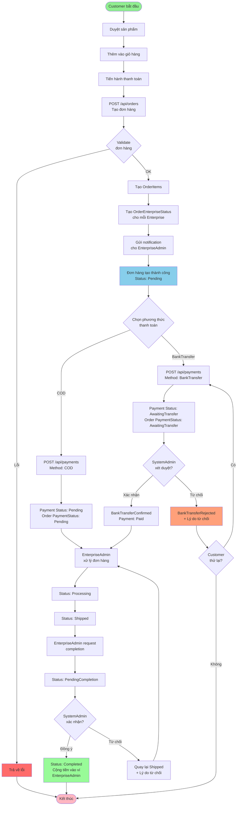
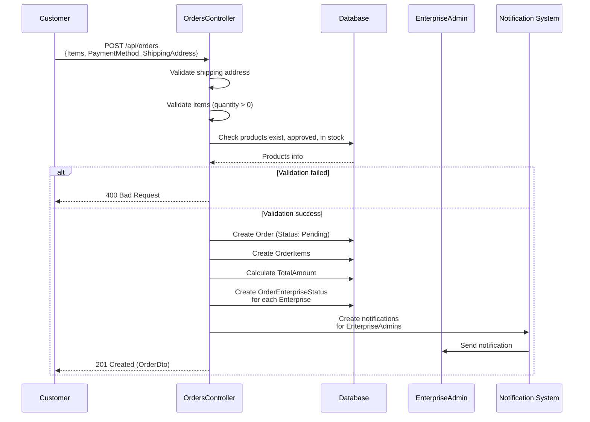
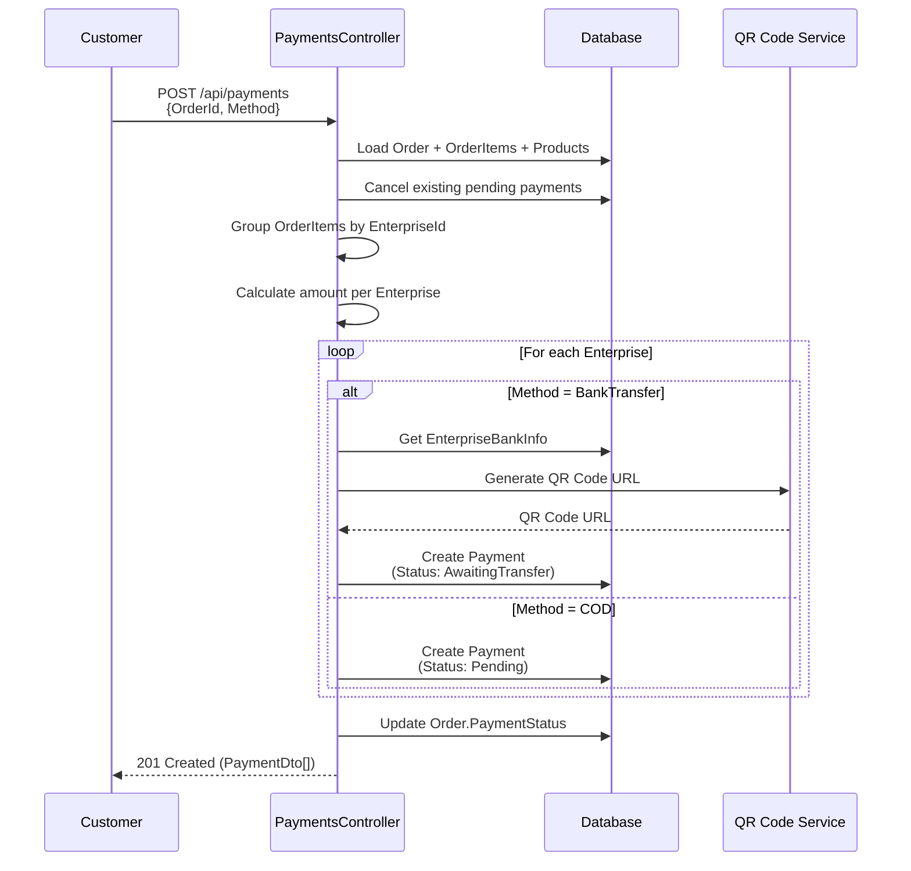
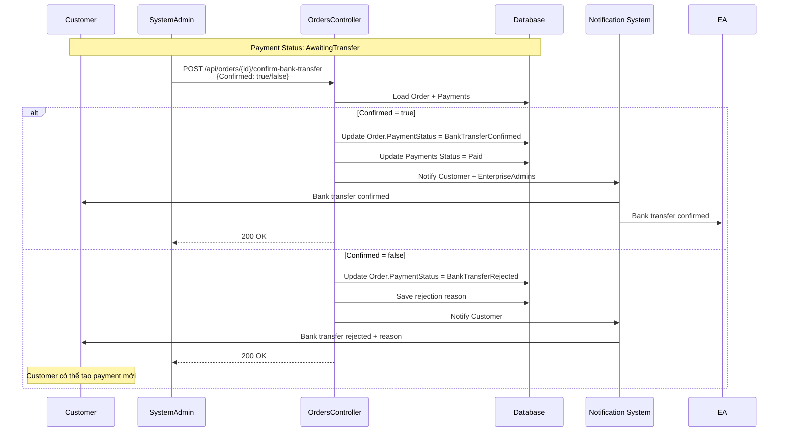
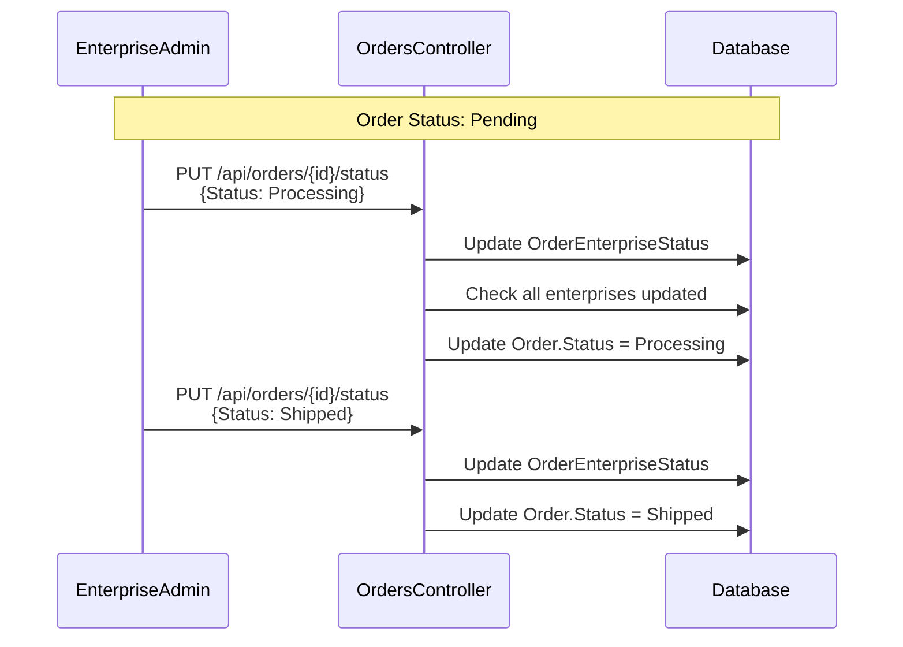
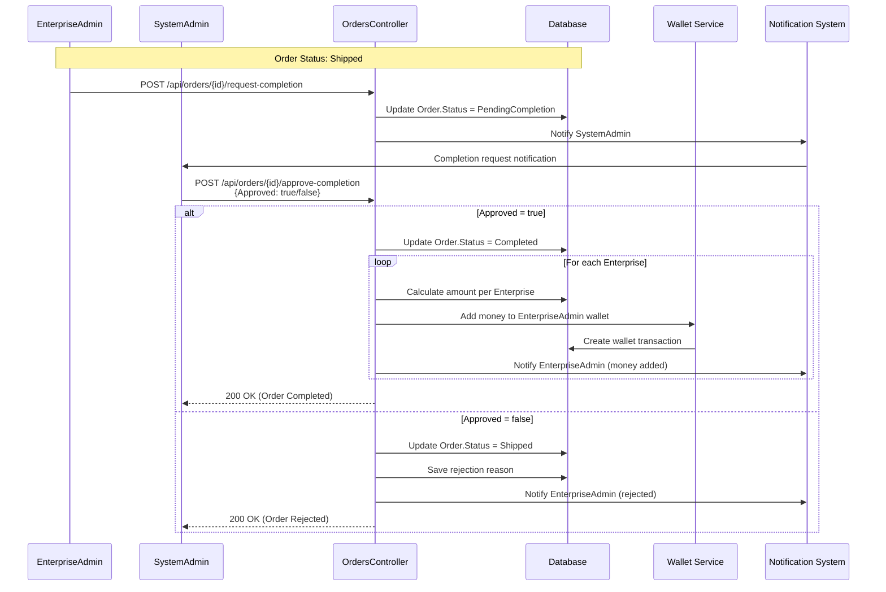
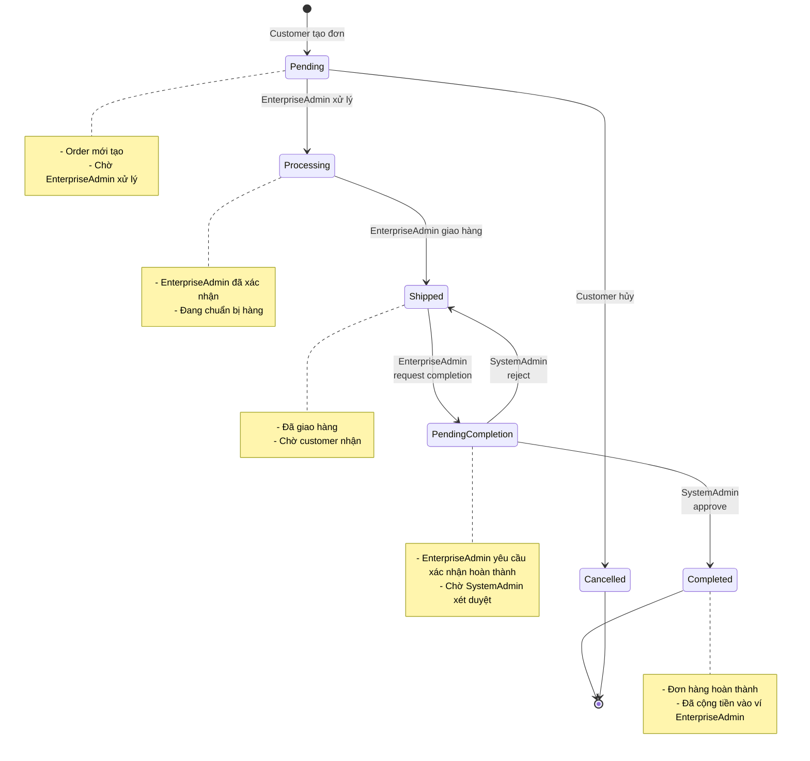
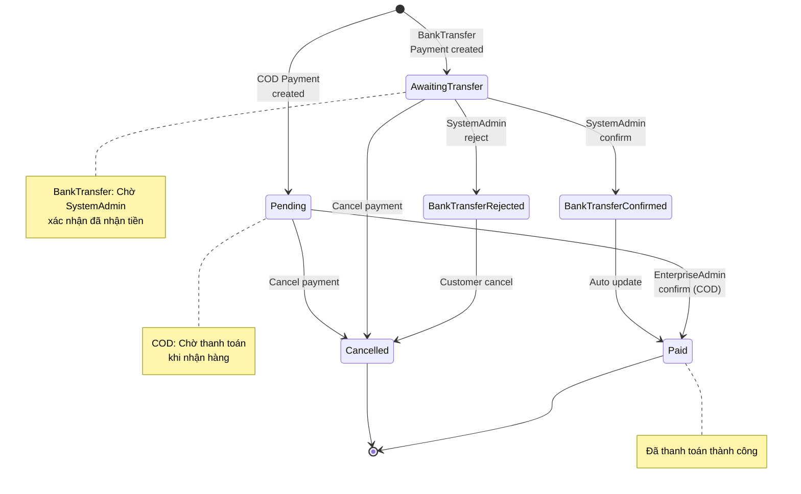
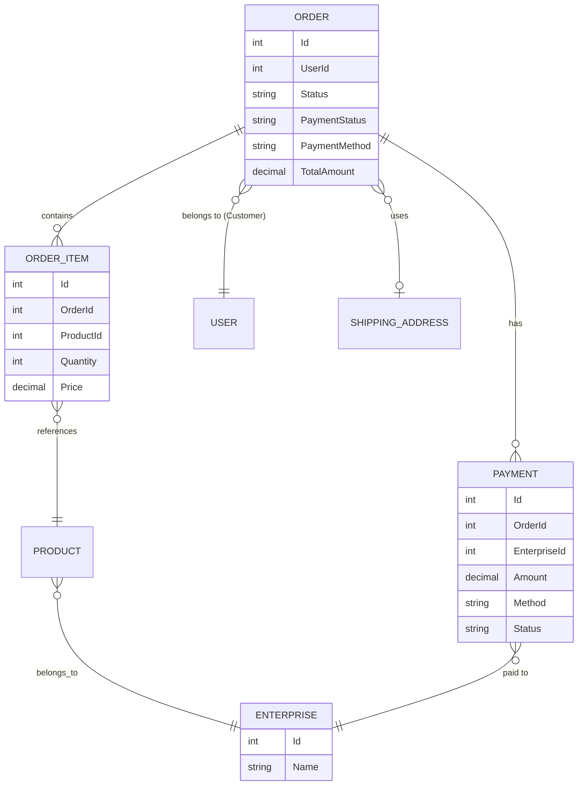

# Luồng Mua Hàng của Customer

## Sơ đồ tổng quan

## Luồng chi tiết theo từng bước

### Bước 1: Tạo Đơn Hàng

### Bước 2: Tạo Thanh Toán

### Bước 3: Xử lý BankTransfer (nếu có)

### Bước 4: Xử lý Đơn Hàng

### Bước 5: Xác nhận Hoàn Thành

## Trạng thái và Chuyển đổi

### Order Status Flow

### Payment Status Flow

## Mối quan hệ giữa Order và Payment

## API Endpoints Summary

### Customer Endpoints

| Method | Endpoint | Mô tả |
|--------|----------|-------|
| POST | `/api/orders` | Tạo đơn hàng mới |
| GET | `/api/orders` | Lấy danh sách đơn hàng của mình |
| GET | `/api/orders/{id}` | Xem chi tiết đơn hàng |
| PUT | `/api/orders/{id}/status` | Hủy đơn hàng (chỉ khi Pending) |
| DELETE | `/api/orders/{id}` | Xóa đơn hàng (chỉ khi Pending/Cancelled) |
| POST | `/api/payments` | Tạo thanh toán cho đơn hàng |
| GET | `/api/payments/order/{orderId}` | Xem các payment của đơn hàng |
| GET | `/api/payments/{id}/qr-code` | Lấy QR code thanh toán |

### EnterpriseAdmin Endpoints

| Method | Endpoint | Mô tả |
|--------|----------|-------|
| GET | `/api/orders` | Xem đơn hàng có sản phẩm của Enterprise mình |
| PUT | `/api/orders/{id}/status` | Cập nhật trạng thái (Processing → Shipped) |
| POST | `/api/orders/{id}/request-completion` | Yêu cầu xác nhận hoàn thành |

### SystemAdmin Endpoints

| Method | Endpoint | Mô tả |
|--------|----------|-------|
| POST | `/api/orders/{id}/confirm-bank-transfer` | Xác nhận/từ chối chuyển khoản |
| POST | `/api/orders/{id}/approve-completion` | Xác nhận/từ chối hoàn thành đơn hàng |

